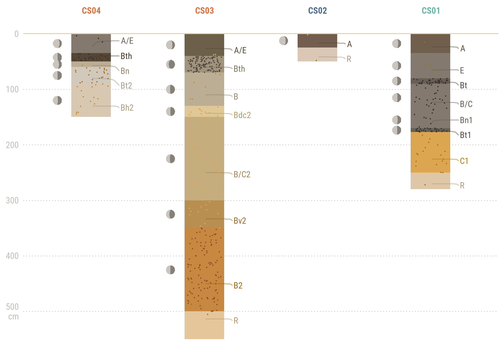

<style type="text/css">
  body{
  font-size: 14pt;}
}
</style>


\

## Los datos

El levantamiento de suelos se realizó con colaboración de  miembros de la comunidad local: en la medición de perfiles, registro del color y la estructura. La base de datos está compuesta por 62 perfiles con información en diferente detalle: 

* 4 perfiles con datos completos de campo y laboratorio
* 27 perfiles con datos de campo parciales, e.g. profundidad, nomenclatura de horizontes y color.
* 31 perfiles con registro fotográfico.

Los perfiles de suelo estudiados en detalle y en campo se utilizaron para interpretar los perfiles que solo contaban con registro fotográfico. De esta interpretación se generalizaron dos tipos de secuencias de horizontes de suelos y paleosuelos, las cuales tienen relevancia para la infiltración de agua, el soporte de la vegetación y los procesos erosivos que modelan el paisaje.


## La distribución de los perfiles

Debido a la accesibilidad a diferentes zonas, los perfiles de suelo estudiados corresponden a exposiciones naturales, en cárcavas, a lo largo de una franja orientada SO-NE. En la figura se descatan cuatro perfiles, los cuales se estudiaron mediante técnicas de campo y laboratorio.

\ 


```r
library(ggplot2)
library(ggrepel) #etiquetas 
library(ggsn) #escala gráfica

ggplot() +
  geom_sf(data = cutout,
          color = "#e2ddd6",
          size = .4)+
  geom_raster(data = DEM_df_clip, 
              aes(fill = altitude, 
                  x=long, 
                  y=lat))+
  scale_fill_gradient2(high= '#f2d29b', 
                       mid='#faf7ef', 
                       low= 'white', 
                       midpoint = 2820, 
                       na.value=NA,
                       guide = F) +
  geom_sf(data = CSsf84, 
          fill = NA,
          color = "#c3beb8",
          size = 0.7) +
  geom_sf(data = min2019sf, 
          fill = "grey30",
          col = "grey30") +
  geom_sf(data=sitio_sf84, 
          aes(col = SECUENCIA), 
          size = 1.5) +
  scale_color_manual(values= col_scp, 
                     name = "Secuencia tipo")+
  # Etiquetas de puntos
  geom_text_repel( data = sitio_sf84[1:4,],   
                   aes(label = ID, geometry = geometry, col = SECUENCIA),
                   size = 3.5,
                   family = "robotoc",
                   fontface = "bold",
                   force_pull  = -0.2,
                   nudge_x = -0.1,
                   direction = "y",
                   box.padding = 0.5,
                   stat = "sf_coordinates",
                   segment.square = FALSE,
                   segment.curvature = -0.3,
                   segment.angle = 30, 
                   segment.ncp = 10,
                   show.legend = FALSE) +
  # Escala gráfica
  ggsn::scalebar(data = CSsf84, 
           dist = 0.5, 
           dist_unit = "km",
           transform = TRUE,
           st.size = 3,
           height=0.015,
           border.size = 0.05,
           box.color = "#e2ddd6",
           box.fill = c("grey20","#e2ddd6"),
           family = "robotoc")+
  # Notas de texto
  annotate(geom = "text", 
           x = -74.168, y = 4.57, 
           label = "Bogotá \n(Ciudad Bolivar)", 
           hjust = "left", 
           size = 4.5,
           family = "roboto",
           fontface = "bold",
           col = "#c3beb8") +
  annotate(geom = "text", 
           x = -74.163, y = 4.548, 
           label = "Minería", 
           size = 3.5,
           family = "roboto",
           fontface = "bold",
           col = "grey30") +
  annotate(geom = "curve", 
           x = -74.163, 
           y = 4.549,
           xend = -74.156, 
           yend = 4.552, 
           curvature = -.3,
           col = "grey30",
           size = 0.5) +
  # Modificación ejes
  scale_x_continuous(breaks=c(-74.18, -74.17, -74.16))+
  scale_y_continuous(breaks=c(4.55,4.56,4.57))+
  # Eje de coordenadas y a la derecha
  coord_sf(label_axes = list(bottom = "E", right = "N", left = NA, top = NA),
           clip = "off") + 
  # Tamaño de ícono color
  guides(color = guide_legend(override.aes = list(size = 3.5))) 
```


\
## Los perfiles

Los cuatro perfiles estudiados en detalle se presentan como modelos con propiedades de campo. En ellos se observan dos secuencias de suelos contrastantes en el paisaje.


```
##      ID BASE TOPE ESP  HZ CON_POR     RGBmx     RGBco    ID_HZ   ID_HZ2
## 1  CS01   35    0  35   A       0 #6F5F4CFF #9C750FFF   CS01 A   CS01 A
## 2  CS01   80   35  45   E       2 #83796FFF #9C750FFF   CS01 E   CS01 E
## 3  CS01   90   80  10  Bt      80 #686057FF #38302AFF  CS01 Bt  CS01 Bt
## 4  CS01  140   90  50 B/C      10 #83796FFF #38302AFF CS01 B/C CS01 B/C
## 5  CS01  170  140  30 Bn1       5 #83796FFF #38302AFF CS01 Bn1 CS01 Bn1
## 6  CS01  177  170   7 Bt1      80 #666157FF #38302AFF CS01 Bt1 CS01 Bt1
## 7  CS01  250  177  73  C1       5 #DCA651FF #AB6D28FF  CS01 C1  CS01 C1
## 8  CS01  280  250  30   R       0 #DEC7A6FF #AB6D28FF   CS01 R   CS01 R
## 9  CS02   25    0  25   A       0 #725D4EFF #DCA651FF   CS02 A   CS02 A
## 10 CS02   50   25  25   R       0 #DAC7B5FF #AB6D28FF   CS02 R   CS02 R
```
 
\
 

```r
ggplot(hz_bdf, aes(x = reorder(ID, desc(ID)), y = ESP, fill = forcats::fct_rev(ID_HZ2))) + 
  geom_bar(position="stack", stat="identity", width = 0.4) +
  scale_fill_manual(values = rev(hz_bdf$RGBmx),
                    guide = FALSE) +
  #y: location from where jitter spreads out vertically, i,e. from the base minus half the tickness
  geom_jitter(data = hz_jdf, aes(x = ID, y = BASE - (ESP/2)),  
              width = 0.18, 
              # height: how far jitter spreads out to each side, i.e. half the tickness
              height = hz_jdf$ESP*0.5,
              size = 0.3,
              col = hz_jdf$RGBco,
              shape = 16)+
  geom_hline(yintercept = 0, col = '#f2d29b')+
  scale_y_reverse(breaks = c(0,100,200,300,400,500), 
                  labels=c("0", "100", "200", "300", "400", "500"))+
  scale_x_discrete(position = "top") +
  theme(axis.text.x = element_text(family = "robotoc",
                           colour = c('#DA7543','#DA7543','#4B6E8E', '#6AB6AA'),
                           face = "bold"),
               axis.ticks.x =  element_blank(),
        panel.grid.major.y = element_line(color = "grey90", size = .4, linetype = c("13")))
```



