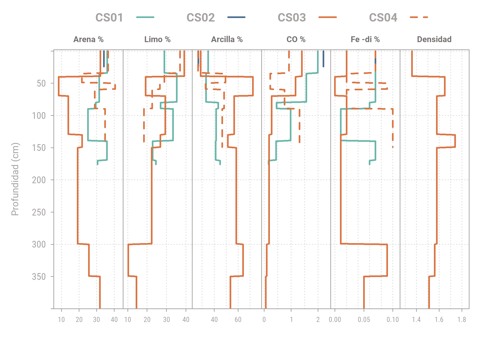
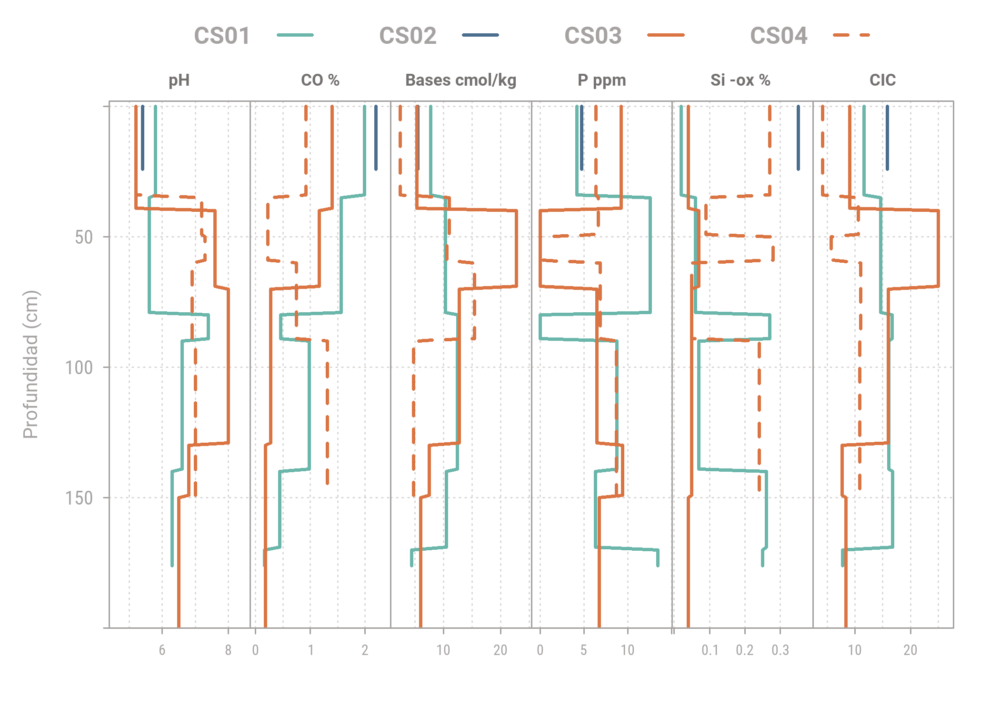
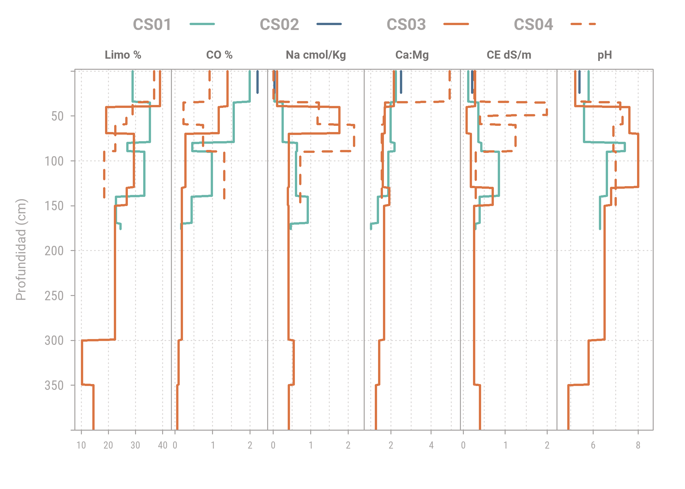

```r
knitr::opts_chunk$set(warning = FALSE, echo = FALSE,  fig.align="center", fig.showtext = TRUE, fig.retina = 1, dpi = 300, out.width = "70%")

library(tidyverse)
```

```
## -- Attaching packages --------------------------------------- tidyverse 1.3.1 --
```

```
## v ggplot2 3.3.5     v purrr   0.3.4
## v tibble  3.1.2     v dplyr   1.0.6
## v tidyr   1.1.3     v stringr 1.4.0
## v readr   1.4.0     v forcats 0.5.1
```

```
## -- Conflicts ------------------------------------------ tidyverse_conflicts() --
## x dplyr::filter() masks stats::filter()
## x dplyr::lag()    masks stats::lag()
```

```r
library(aqp)
```

```
## This is aqp 1.29
```

```
## 
## Attaching package: 'aqp'
```

```
## The following objects are masked from 'package:dplyr':
## 
##     combine, filter, group_by, mutate, slice, summarize
```

```
## The following object is masked from 'package:stats':
## 
##     filter
```

```r
library(sp)
library(lattice)
library(colorspace)
library(showtext) #google fonts
```

```
## Loading required package: sysfonts
```

```
## Loading required package: showtextdb
```

### Los perfiles

Los cuatro perfiles estudiados en detalle se presentan como modelos (Fig) con propiedades de campo. En ellos se observan dos secuencias de suelos contrastantes en el paisaje:


### Las propiedades 

En la Fig. 3 se presenta la distribución de partículas de arena, limo y arcilla, que tiene un patrón similar para las secuencias tipo B y C (esta última, de mayor ocurrencia en el parque):  un horizonte arenoso / areno-limoso superficial (A/E) que facilita la infiltración y escorrentía subsuperficial, subyacido por uno o mas horizontes arcillosos (Bt), que dificultan la infiltración a través de la matriz del suelo. El horizonte Bt mas superficial tiene un alto contenido de bases, que indican que los procesos de lixiviación -y por tanto la infiltración- son escasos. A aproximadamente 1m de profundidad se observa un horizonte duro, debido en parte a enriquecimiento de minerales estables de Fe, y con notables grietas verticales. El perfil CS03 presenta a ca. 3m de profundidad un horizonte plíntico, extremadamente duro, muy rico en Fe estable, que bloquea la infiltración.

La secuencia tipo A tiene, en comparación con la secuencia tipo C, más arena y limo que arcilla a través del perfil CS01. Se observan algunos horizontes Bt delgados, ricos en arcilla, materia orgánica y bases, que dificiltan la infiltración a través de la matriz. Sin embargo, la materia orgánica cubre las caras de terrones estables de forma angular y subangular, facilitando la infiltración por macroporos. Los óxidos de hierro estables e inestables ocurren en horizontes limosos y arenosos sin formar capas endurecidas.


```r
# Nombres para paneles
strip_names <-c( "Arena %", "Limo %","Arcilla %","CO %","Fe -di %", "Densidad")


xyplot(top ~ p.q50 | variable, 
       groups = which,
       data=CShg,
       ylab=list(label ='Profundidad (cm)', fontsize = 9.5),
       xlab=list(label = ""),
       lower=CShg$p.q25, upper=CShg$p.q75, ylim=c(400,-2),
       panel=panel.depth_function2,
       sync.colors=TRUE,
       par.settings= sty,
       prepanel=prepanel.depth_function,
       layout=c(6,1), 
       strip=strip.custom(bg= NA, 
                          par.strip.text=list(font=2, 
                                              cex=0.7, 
                                              col= darken("#F5F2F1", 
                                                          0.5, 
                                                          space = "HCL")),
                          factor.levels=strip_names),
       scales=list(x=list(tick.number=3, alternating=1, relation='free', cex = 0.6), 
                   y = list(tick.number=6)),
       auto.key=list(columns=4, 
                     lines=TRUE, 
                     points=FALSE, 
                     col = darken("#F5F2F1", 0.3, space = "HCL"),
                     size = 2.5,
                     font = 2)) #legend
```



La Fig. 4 presenta la distribución de propiedades químicas que tienen efectos en la vegetación. La textura areno-limosa que presentan todas las secuencias en los primeros 50 cm (Fig. 3)  facilita la penetración de raíces. A esta profundidad, sin embargo, no hay buena disponibilidad de nutrientes, como lo evidencian el pH bajo, bajo contenido de materia orgánica, fósforo y baja capacidad de intercambio catiónico. La presencia de mineraloides de aluminio y sílice en mayor concentración a este nivel indica sin embargo que existen condiciones para almacenar nutrientes.

Por debajo de los 50 cm las condiciones de nutrientes mejoran en varios aspectos: el pH es neutro a básico, el fósforo (al menos para la secuencia tipo A) aumenta, y la capacidad de intercambio catiónico aumenta. Estas características explican la presencia de raíces penetrando horizontes arcillosos a profundidad de 1m en algunos suelos, lo cual tiene un efecto positivo en la infiltración. 


```r
# Nombres para paneles
strip_names <-c( "pH", "CO %","Bases cmol/kg","P ppm","Si -ox % ", "CIC")

xyplot(top ~ p.q50 | variable, 
       groups = which,
       data=CSbg,
       ylab=list(label ='Profundidad (cm)', fontsize = 9.5),
       xlab=list(label = ""),
       lower=CSbg$p.q25, upper=CSbg$p.q75, ylim=c(200,-2),
       panel=panel.depth_function2,
       sync.colors=TRUE,
       par.settings= sty,
       prepanel=prepanel.depth_function,
       layout=c(6,1), 
       strip=strip.custom(bg= NA, 
                          par.strip.text=list(font=2, 
                                              cex=0.7, 
                                              col= darken("#F5F2F1", 
                                                          0.5, 
                                                          space = "HCL")),
                          factor.levels=strip_names),
       scales=list(x=list(tick.number=3, alternating=1, relation='free', cex = 0.6), 
                   y = list(tick.number=6)),
       auto.key=list(columns=4, 
                     lines=TRUE, 
                     points=FALSE, 
                     col = darken("#F5F2F1", 0.3, space = "HCL"),
                     size = 2.5,
                     font = 2)) #legend
```



La Fig. 5 presenta las propiedades que afectan la erosión.  Las partículas de tamaño limo son mas propensas a la erosión física que la arena (debido a su peso) y la arcilla (debido a su aglomeración). En este sentido, la secuencia tipo C es mas propensa a la erosión por escorrentía superficial.  El socavamiento subsuperficial ocurre por acción química en horizontes arcillosos, que se observa cuando el sodio intercambiable aumenta, la relación calcio: magnesio es menor o cercana a 2 y la conductividad eléctrica es baja. Estas condiciones se observan en varios horizontes de las secuencias A y C por debajo de 1m. El aumento de pH a esta profundidad genera un efecto desestabilizante para los coloides de arcilla, debido al incremento de cargas negativas, en la superficie de los minerales, que generan un efecto repulsivo entre partículas. 


```r
strip_names <-c( "Limo %","CO %" ,"Na cmol/Kg", "Ca:Mg","CE dS/m","pH")

xyplot(top ~ p.q50 | variable, 
       groups = which,
       data=CSeg,
       ylab=list(label ='Profundidad (cm)', fontsize = 9.5),
       xlab=list(label = ""),
       lower=CSeg$p.q25, upper=CSeg$p.q75, ylim=c(400,-2),
       panel=panel.depth_function2,
       sync.colors=TRUE,
       par.settings= sty,
       prepanel=prepanel.depth_function,
       layout=c(6,1), 
       strip=strip.custom(bg= NA, 
                          par.strip.text=list(font=2, 
                                              cex=0.7, 
                                              col= darken("#F5F2F1", 
                                                          0.5, 
                                                          space = "HCL")),
                          factor.levels=strip_names),
       scales=list(x=list(tick.number=3, alternating=1, relation='free', cex = 0.6), 
                   y = list(tick.number=6)),
       auto.key=list(columns=4, 
                     lines=TRUE, 
                     points=FALSE, 
                     col = darken("#F5F2F1", 0.3, space = "HCL"),
                     size = 2.5,
                     font = 2)) #legend
```



`

