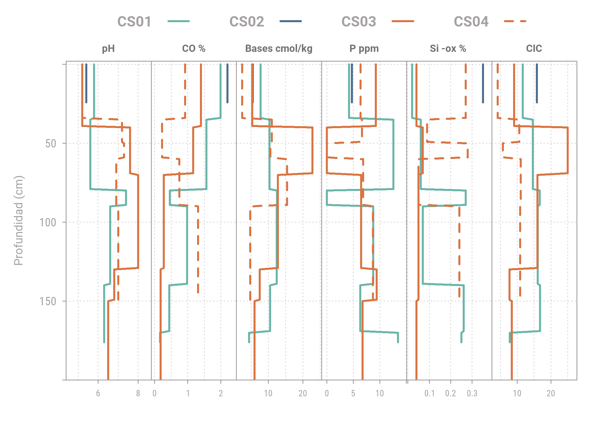

```r
knitr::opts_chunk$set(include = FALSE, echo = FALSE, warning = FALSE,message = FALSE, fig.align="center", fig.showtext = TRUE, fig.retina = 1, dpi = 300, out.width = "75%", dev = "ragg_png")

library(tidyverse)
library(aqp)
library(sp)
library(lattice)
library(colorspace)
library(showtext) #google fonts
```


## Las propiedades 


### Código: xyplot 
#### Propiedades relevantes para infiltración


```r
# Nombres para paneles
strip_names <-c( "Arena %", "Limo %","Arcilla %","Fe -di %", "Densidad", "Ks cm/día")


xyplot(top ~ p.q50 | variable, 
       groups = which,
       data=CShg,
       ylab=list(label ='Profundidad (cm)', fontsize = 9.5),
       xlab=list(label = ""),
       lower=CShg$p.q25, upper=CShg$p.q75, ylim=c(400,-2),
       panel=panel.depth_function2,
       sync.colors=TRUE,
       par.settings= sty,
       prepanel=prepanel.depth_function,
       layout=c(6,1), 
       strip=strip.custom(bg= NA, 
                          par.strip.text=list(font=2, 
                                              cex=0.7, 
                                              col= darken("#F5F2F1", 
                                                          0.5, 
                                                          space = "HCL")),
                          factor.levels=strip_names),
       scales=list(x=list(tick.number=3, alternating=1, relation='free', cex = 0.6), 
                   y = list(tick.number=6)),
       auto.key=list(columns=4, 
                     lines=TRUE, 
                     points=FALSE, 
                     col = darken("#F5F2F1", 0.3, space = "HCL"),
                     size = 2.5,
                     font = 2)) #legend
```


### Código: xyplot
#### Propiedades relevantes para vegetación


```r
# Nombres para paneles
strip_names <-c( "pH", "CO %","Bases cmol/kg","P ppm","Si -ox % ", "CIC")

xyplot(top ~ p.q50 | variable, 
       groups = which,
       data=CSbg,
       ylab=list(label ='Profundidad (cm)', fontsize = 9.5),
       xlab=list(label = ""),
       lower=CSbg$p.q25, upper=CSbg$p.q75, ylim=c(200,-2),
       panel=panel.depth_function2,
       sync.colors=TRUE,
       par.settings= sty,
       prepanel=prepanel.depth_function,
       layout=c(6,1), 
       strip=strip.custom(bg= NA, 
                          par.strip.text=list(font=2, 
                                              cex=0.7, 
                                              col= darken("#F5F2F1", 
                                                          0.5, 
                                                          space = "HCL")),
                          factor.levels=strip_names),
       scales=list(x=list(tick.number=3, alternating=1, relation='free', cex = 0.6), 
                   y = list(tick.number=6)),
       auto.key=list(columns=4, 
                     lines=TRUE, 
                     points=FALSE, 
                     col = darken("#F5F2F1", 0.3, space = "HCL"),
                     size = 2.5,
                     font = 2)) #legend
```



### Código: xyplot
#### Propiedades relevantes para erosión


```r
strip_names <-c( "Limo %","CO %" ,"Na cmol/Kg", "Ca:Mg","CE dS/m","pH")

xyplot(top ~ p.q50 | variable, 
       groups = which,
       data=CSeg,
       ylab=list(label ='Profundidad (cm)', fontsize = 9.5),
       xlab=list(label = ""),
       lower=CSeg$p.q25, upper=CSeg$p.q75, ylim=c(400,-2),
       panel=panel.depth_function2,
       sync.colors=TRUE,
       par.settings= sty,
       prepanel=prepanel.depth_function,
       layout=c(6,1), 
       strip=strip.custom(bg= NA, 
                          par.strip.text=list(font=2, 
                                              cex=0.7, 
                                              col= darken("#F5F2F1", 
                                                          0.5, 
                                                          space = "HCL")),
                          factor.levels=strip_names),
       scales=list(x=list(tick.number=3, alternating=1, relation='free', cex = 0.6), 
                   y = list(tick.number=6)),
       auto.key=list(columns=4, 
                     lines=TRUE, 
                     points=FALSE, 
                     col = darken("#F5F2F1", 0.3, space = "HCL"),
                     size = 2.5,
                     font = 2)) #legend
```


