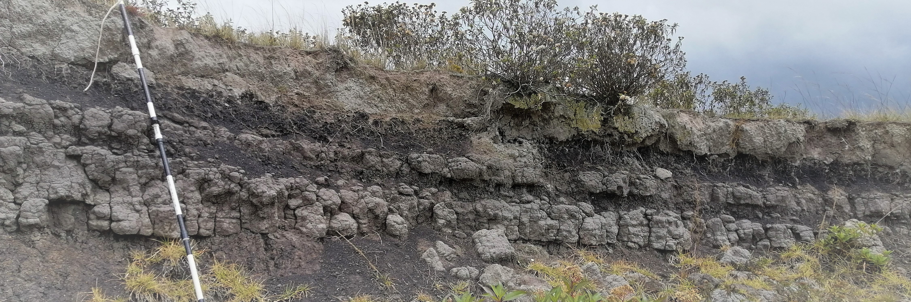

# TCI_Cerro-Seco_GIT
 Data, analysis and visualizations from a citizen-based soil survey in the area known as Cerro Seco,  southern Bogotá.
 Project **funded** by the *True Cost Initiative* through *Corporación Geoambiental Terrae (NGO)*. 
