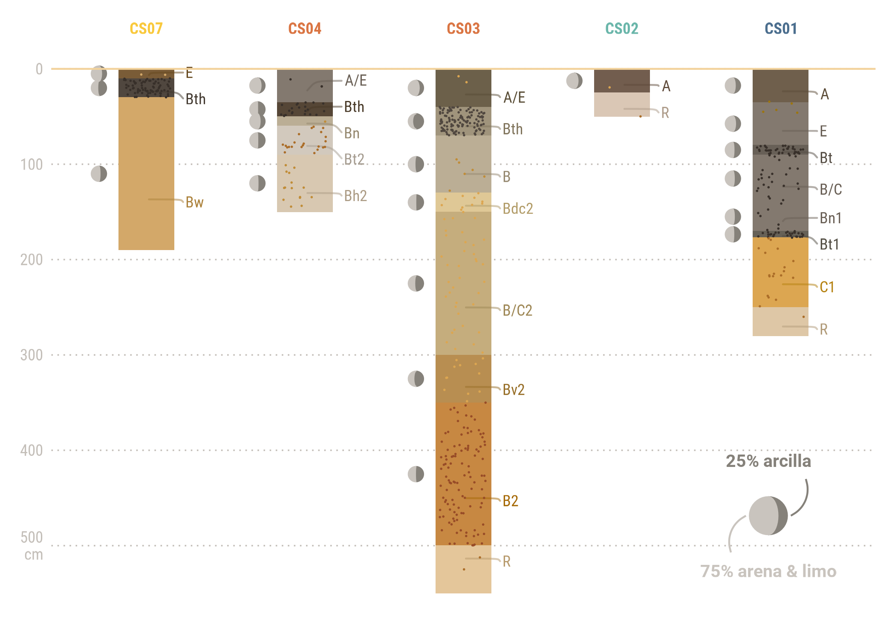
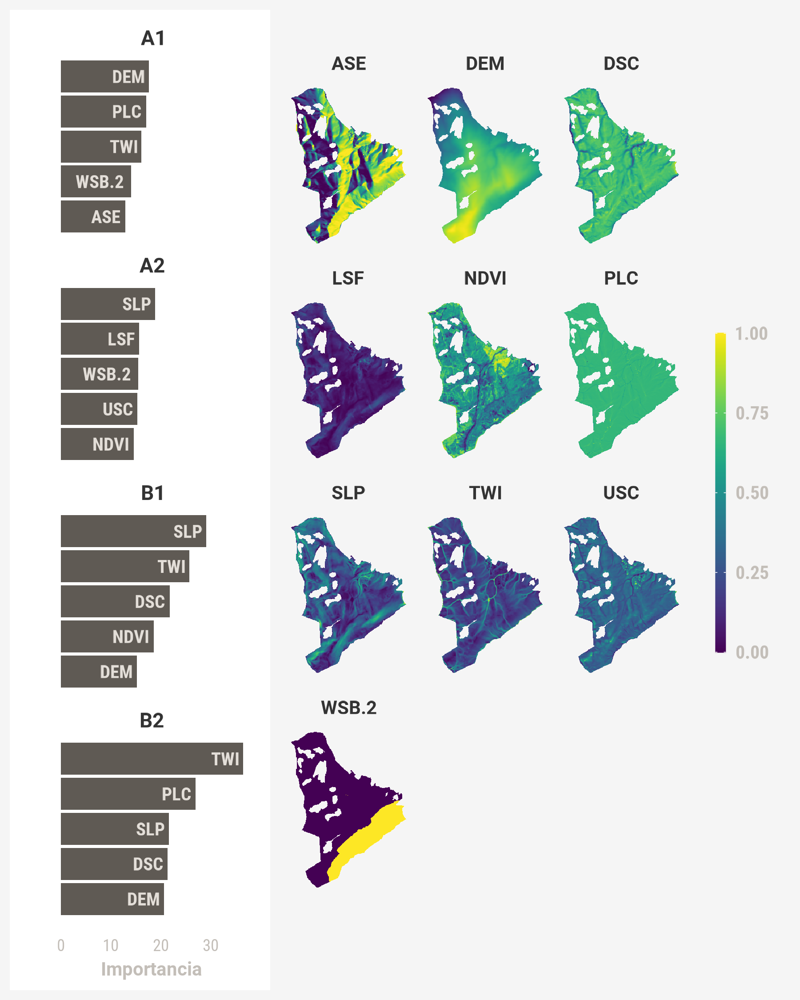

# Cerro Seco - Digital Soil Mapping

 

 ## In this repository you will find:
 * ### [Field and laboratory data](/Datos)
 * ### [Spatial data](/Datos_GIS)
 * ### [R code](/R)
 * ### [Simplified reports](/Reportes)
 * ### [Visualizations](/Graficas)

The data comes from a citizen-based soil survey in the area known as [Cerro Seco](https://goo.gl/maps/C2dALBSiKC8B5a4k9) (southern Bogotá). It was collected between 06.2020 and 07.2021. **Funds** for this project were given by the [*True Cost Initiative*](https://truecostsinitiative.org/) to [*Corporación Geoambiental Terrae (NGO)*](https://www.terraegeoambiental.org/), with whom I collaborate.
 
This study aims to create a preliminary map of soil (paleosol) sequence distribution in the area, using machine learning classification. It will be integrated with hydrological models of typical soil profiles and of the underlying rock, to make a first estimate of water recharge and overflow/interflow in the area. Information will be submitted to the *Secretaría Distrital de Planeación* and the *Secretaría Distrital de Ambiente* to support the creation and management of a new conservation area in Cerro Seco.
 
## Study locations · *Ubicaciones de estudio*
  
 
## Model profiles of paleosoil/hydropedologic sequences

 
 ## Random Forest Importance of indices derived from RS
 
 
 ## Preliminary models
 
 
